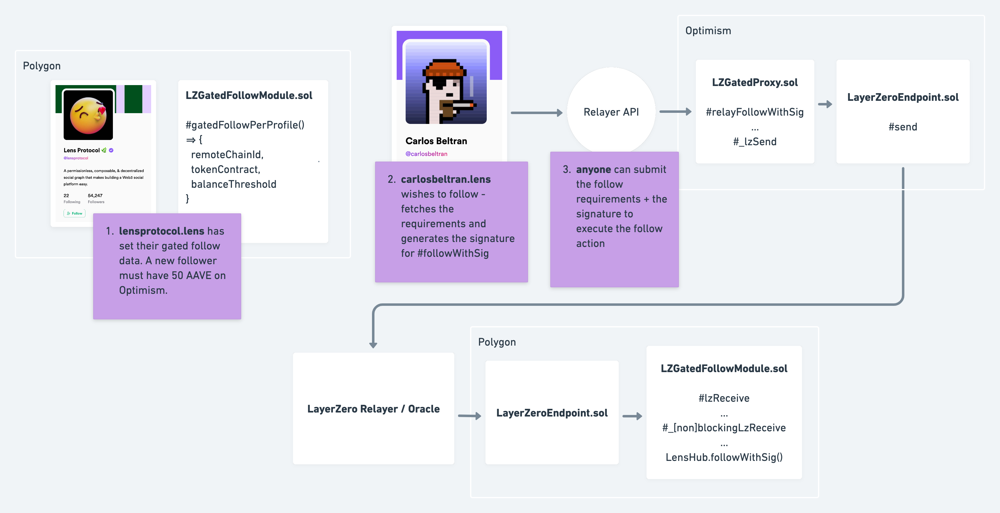
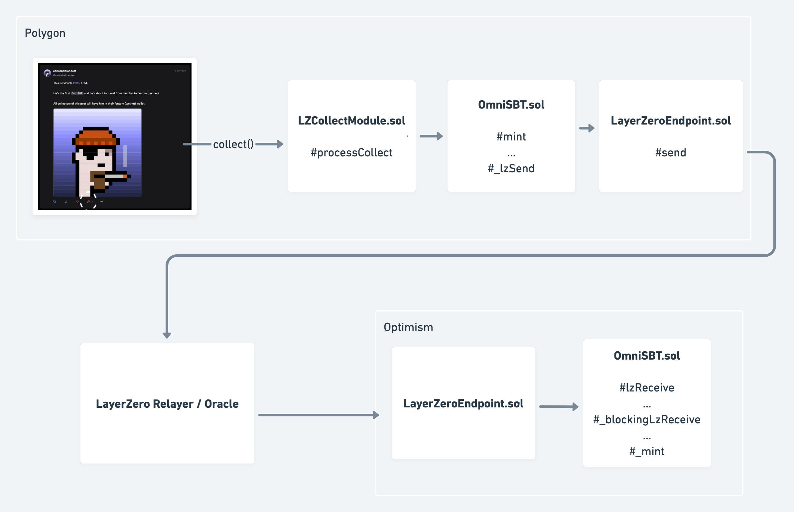

# Gate your Lens follows, collects, and mirrors - cross-chain - via LayerZero

This is a technical overview of the [Lens](https://lens.xyz/) modules we developed to allow token-gated, cross-chain actions via [LayerZero](https://layerzero.network/). The source code for this entire project can be found on [this github repo](https://github.com/hyplabs/lz-collect-module).

// @TODO: update the repo

## Overview

Consider the different ways that a Lens profile would want to set to gate their social content
```
- Only wallets with 50 AAVE on Optimism can follow me
- Only owners of a CryptoPunk on Ethereum can collect my latest post
- Only collectors of my NFT collection on Arbitrum can comment on my posts
```

For each of these scenarios, we have a Lens module - a smart contract that processes the Lens action (follow, collect, comment/mirror) before allowing it to execute. Using LayerZero, we can enable token-gating against contracts deployed on chains other than where the Lens action is occurring (ex: `mumbai`, `polygon`). These modules are available for Lens profiles to configure with whatever parameters they want. Any supported chain, and any ERC20/ERC721 contract + token balance.

## Cross-chain gated follows

Let's go in depth with our `LZGatedFollowModule`, which processes our cross-chain, token-gated follows.

In this example, a Lens profile has set their follow module to our `LZGatedFollowModule` and configured such that new followers must hold 50 AAVE tokens on Optimism.



1. **lensprotocol.lens** has set their gated follow data. A new follower must have 50 AAVE on Optimism.
2. **carlosbeltran.lens** wishes to follow - fetches the requirements and generates the signature for `#followWithSig`
3. anyone (ex: a relayer) can submit the follow requirements + the signature to the `LZGatedProxy` contract on Optimism, which relays the payload to the `LZGatedFollowModule` contract on Polygon via LayerZero

We can see that the token balance check happens on Optimism, and the `#followWithSig` transaction is executed on Polygon.

The intermediate contract is `LZGatedProxy`; this contract simply does the token balance check and relays the payload to our module contract on the destination chain. It's a LayerZero-enabled contract, meaning it can _send_ cross-chain payloads to trusted remote contracts. Our modules are configured to _receive_ cross-chain payloads from a trusted remote contracts. We'll explain this LayerZero wiring later.

For now, let's look at the main functions within our follow module.

### LZGatedFollowModule.sol
`LZGatedFollowModule` is Lens Follow Module that allows profiles to gate their following with ERC20 or ERC721 balances held on other chains. The typical flow is:
- a profile initializes this module with a supported LayerZero chain id and a erc20/erc721 contract + balance to check against
- another user wishes to follow, they read the requirements using `gatedFollowPerProfile` which points to the chain/token/balance
- user generates `followWithSigData`
- user (or relayer) submits this sig along with appropriate input to the `LZGatedProxy` contract on the other chain
- `LZGatedProxy` makes the token check, and relays the message to the `LZGatedFollowModule` on polygon
- `LZGatedFollowModule` contract validates the input, submits sig to `LensHub#followWithSig`
- follow is processed ✅

The two main functions in this contract are `#initializeFollowModule` and `#processFollow`; these are the callback functions the [LensHub](https://docs.lens.xyz/docs/lenshub) contract invokes when a this module is set as a profile's follow module, and when a follow action on the given profile is attempted.

// @TODO: keep it going
// - finish this module
// - conclude that similar setup in others
// - hardhat tasks
// - finish testing
// - conclusion

The constructor arguments include the address for the `OmniSBT` contract. The interactions with that contract are
1. validate that the `chainId` param provided in the init callback is supported
2. create a collection pointer
3. send the "mint" payload to the destination chain via layer zero

Here's the function interface for `#initializePublicationCollectModule`

```solidity
/**
 * @dev Initialize publication collect data for the given `pubId`, including the destination chain to mint the OmniSBT
 * @param profileId: the lens profile
 * @param pubId: the post
 * @param data: encoded data to init this module (followerOnly, chainId)
 */
function initializePublicationCollectModule(
  uint256 profileId,
  uint256 pubId,
  bytes calldata data
) external override onlyHub returns (bytes memory) {}
```

When a post is initialized with this module, the caller must specify two things - whether the post can be only be collected by followers, and which LayerZero `chainId` the NFT should be minted for collectors. These values are encoded in the `data` param.

When a post that has been initialized with this module is collected, our `#processCollect` function is invoked

```solidity
/**
 * @dev Processes a collect by:
 * - [optional] ensuring the collector is a follower
 * - minting a OmniSBT on the destination chain set
 */
function processCollect(
  uint256, // referrerProfileId
  address collector,
  uint256 profileId,
  uint256 pubId,
  bytes calldata // data
) external override onlyHub {}
```

This is the function that triggers the cross-chain messaging logic in our `OmniSBT` contract.

### OmniSBT.sol
`OmniSBT` creates Soulbound Tokens (SBTs) that mint on a remote destination chain; they are non-transferrable, and burnable.

This contract inherits from our `LzApp` contract which wires up our contract for sending and receiving messages via LayerZero "endpoint" contracts.

Let's look at the constructor for both contracts, as it gives us all the context we need to know before looking at the mint flow.

```solidity
/**
 * @dev OmniSBT contract constructor
 * NOTE: array length will only be one when deploying to a "destination" chain. the "source" contract will contain
 * all references to other deployed contracts
 * @param _lzEndpoint: LayerZero endpoint on this chain to relay messages
 * @param remoteChainIds: whitelisted destination chain ids (supported by LayerZero)
 * @param remoteContracts: whitelisted destination contracts (deployed by us)
 * @param _isSource: whether this contract is deployed on the "source" chain
 */
constructor(address _lzEndpoint, uint16[] memory remoteChainIds, bytes[] memory remoteContracts, bool _isSource)
  LzApp(_lzEndpoint, msg.sender, remoteChainIds, remoteContracts)
  ERC4973("Omni Soulbound Token", "OMNI-SBT")
{
  zroPaymentAddress = address(0);
  isSource = _isSource;
}
```

```solidity
/**
 * @dev LzApp contract constructor
 * @param _lzEndpoint: The LZ endpoint contract deployed on this chain
 * @param owner: The contract owner
 * @param remoteChainIds: remote chain ids to set as trusted remotes
 * @param remoteContracts: remote contracts to set as trusted remotes
 */
constructor(
  address _lzEndpoint,
  address owner,
  uint16[] memory remoteChainIds,
  bytes[] memory remoteContracts
) Owned(owner) {
  if (_lzEndpoint == address(0)) { revert NotZeroAddress(); }
  if (remoteChainIds.length != remoteContracts.length) { revert ArrayMismatch(); }

  lzEndpoint = ILayerZeroEndpoint(_lzEndpoint);

  uint256 length = remoteChainIds.length;
  for (uint256 i = 0; i < length;) {
    _lzRemoteLookup[remoteChainIds[i]] = remoteContracts[i];
    unchecked { i++; }
  }
}
```

In short, we define the accepted chain ids and set the trusted remote contract addresses to relay messages to, and receive messages from. This way, when we process a collect for a post, we know where to relay messages based on the validated info set by the post creator. For more info on the LayerZero endpoint, check out their [docs](https://layerzero.gitbook.io/docs/faq/layerzero-endpoint).

From here, it's helpful to picture the chain of function calls in order to understand the flow.


** it's important to note that `OmniSBT.sol` is a single contract deployed on both Polygon _and_ Optimism - it can send _and_ receive lz messages

1. [on Polygon] someone collects our lens post
2. our callback `LZCollectModule#processCollect` is triggered
3. we call our mint function on `OmnitSBT` which makes an internal call to `#_lzSend`
4. we call `#send` on the `LayerZeroEndpoint` contract with our payload
5. LayerZero moves our payload from Polygon to Optimism via an Oracle and Relayer
6. [on Optimism] the `LayerZeroEndpoint` contract receives our payload
7. our payload is received in our `OmnitSBT` contract via the callback `#lzReceive` which makes an internal call to `#mint`, minting the NFT for the collector

It's worth seeing how we receive messages in our `OmnitSBT` contract
```solidity
// LzApp.sol

function lzReceive(
  uint16 _srcChainId,
  bytes memory _srcAddress,
  uint64 _nonce,
  bytes memory _payload
) public virtual override {
  if (msg.sender != address(lzEndpoint)) { revert OnlyEndpoint(); }

  bytes memory trustedRemote = _lzRemoteLookup[_srcChainId];
  if (_srcAddress.length != trustedRemote.length || keccak256(_srcAddress) != keccak256(trustedRemote)) {
    revert OnlyTrustedRemote();
  }

  _blockingLzReceive(_srcChainId, _srcAddress, _nonce, _payload);
}
```

- we assert that only the `LayerZeroEndpoint` contract can call
- we assert that we only receive messages from trusted remote contracts (set in the constructor or via `#setTrustedRemote`)
- we pass along the arguments to `#_blockingLzReceive` to process in a **blocking** way. This means that on transaction reverts/errors `LayerZeroEndpoint` contract will block the message queue from the "source" chain until the transaction is retried successfully ([see more](https://layerzero.gitbook.io/docs/faq/messaging-properties#message-ordering))

The end result: the account that collected the post on Polygon now has a soulbound NFT on Optimism :partying_face:
